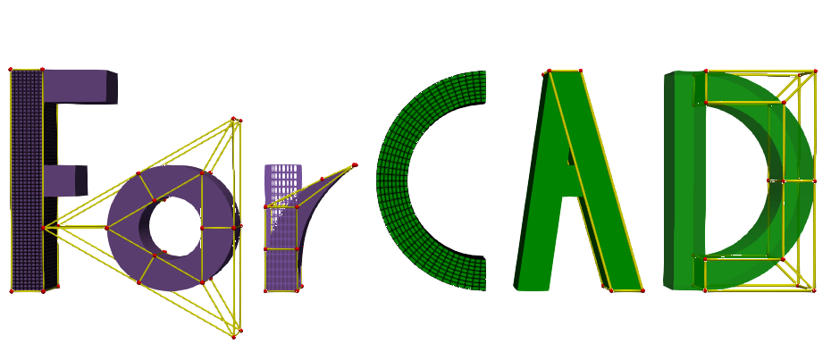

[](https://github.com/gha3mi/forcad)
[](https://gha3mi.github.io/forcad/)
[](https://github.com/gha3mi/forcad/actions/workflows/CI-CD.yml)
[](https://codecov.io/gh/gha3mi/forcad)
[](https://github.com/gha3mi/forcad/blob/main/LICENSE)
[](https://zenodo.org/doi/10.5281/zenodo.10904447)



**ForCAD**: A parallel Fortran library for geometric modeling using NURBS (Non-Uniform Rational B-Splines).

ForCAD supports **B-Spline**, **NURBS**, **Bezier** and **Rational Bezier** curves, surfaces and volumes.

## Main Features

- Parallelized using `do concurrent`.
- Create NURBS objects by specifying control points, weights and knots.
- Refine NURBS objects by inserting or removing knots and elevating degree.
- Compute analytical basis functions and their first and second derivatives for NURBS and B-Spline objects.
- Generation of IGA-compatible element connectivity and shape functions.
- Obtain visualized elements connectivity and coordinates for geometry and control geometry.
- Mesh insertion into a NURBS object.
- Export NURBS objects to VTK files for visualization.
- Export of NURBS curves and surfaces to IGES format (volumes currently not supported).
- Includes predefined NURBS shapes: Circle, Half Circle, Tetragon, Hexahedron, 2D Ring, Half 2D Ring, 3D Ring, Half 3D Ring, C-shapes.
- Rotate and translate NURBS objects.
- Visualization using provided python PyVista scripts.
- Least squares fitting for B-Spline curves, surfaces and volumes.
- Numerical integration of: NURBS curve length, NURBS surface area and NURBS volume.

## Examples

  

  

  

## Installation

### Requirements

* A Fortran compiler, such as:

  * [GNU Fortran (`gfortran`)](https://gcc.gnu.org/fortran/)
  * [Intel Fortran Compiler (`ifx`)](https://www.intel.com/content/www/us/en/developer/tools/oneapi/hpc-toolkit.html)
  * [NVIDIA HPC SDK Fortran Compiler (`nvfortran`)](https://developer.nvidia.com/hpc-sdk)
  * [LLVM Flang (`flang`)](https://flang.llvm.org/)

  **Note:** Latest compiler versions are required to ensure compatibility.

* [Fortran Package Manager (`fpm`)](https://fpm.fortran-lang.org/)

* Optional visualization tools:

  * [PyVista](https://pyvista.org/) (recommended)
  * [ParaView](https://www.paraview.org/)


### Clone the repository

Clone the ForCAD repository from GitHub:

```shell
git clone https://github.com/gha3mi/forcad.git
cd forcad
```

### Install PyVista (Optional)

To install PyVista, run the following command:

```shell
pip install pyvista
```

### Running Examples with fpm

```shell
fpm run --example <file name excluding the .f90 extension> --compiler gfortran --profile release --flag "-ftree-parallelize-loops=8 -march=native"
```
After executing the examples, `.vtk` files will be generated in the `vtk` directory. To visualize these files, a `show()` method is provided which utilizes PyVista. Alternatively, other visualization tools like ParaView can also be used.

### Using ForCAD as a fpm Dependency

If you want to use ForCAD as a dependency in your own fpm project,
you can easily include it by adding the following line to your `fpm.toml` file:

```toml
[dependencies]
forcad = {git="https://github.com/gha3mi/forcad.git"}
```

### Do Concurrent Support

Compiler flags for enabling `do concurrent` parallelism:

| Compiler    | Flag(s)                                     |
| ----------- | ------------------------------------------- |
| `gfortran`  | `-fopenmp -ftree-parallelize-loops=n`       |
| `ifx`       | `-qopenmp -fopenmp-target-do-concurrent`    |
| `nvfortran` | `-stdpar=multicore,gpu -Minfo=stdpar,accel` |
| `flang-new` | ?                                           |
| `lfortran`  | ?                                           |

Compiler flags can be passed to fpm using the `--flag` option, for example:

```shell
fpm build --flag "-stdpar=multicore,gpu -Minfo=stdpar,accel"
```

Alternatively, flags can be added to a `fpm.rsp` file in the root directory of the project.

### Precision Configuration

The library uses **double precision** (`real64`) by default for all real-valued computations. To change the precision, you can define one of the following preprocessor flags during compilation:

| Preprocessor Flag    | Fortran Kind             | Description               |
|----------------------|--------------------------|---------------------------|
| `REAL32`             | `selected_real_kind(6)`  | Single precision          |   
| `REAL64` *(default)* | `selected_real_kind(15)` | Double precision          |
| `REALXDP`            | `selected_real_kind(18)` | Extended double precision |
| `REAL128`            | `selected_real_kind(33)` | Quadruple precision       |

**Note**: The examples `example_ppm1.f90`, `example_ppm2.f90` and `example_ppm3.f90` use the `ForColormap` library, which only supports `REAL64` precision.

#### Example: Building with double precision

```bash
fpm build --profile release --flag "-DREAL64"
```

## CI Status

<!-- STATUS:setup-fortran-conda:START -->
| Compiler   | macos | ubuntu | windows |
|------------|----------------------|----------------------|----------------------|
| `flang-new` | - | fpm ✅  cmake ❌ | fpm ✅  cmake ✅ |
| `gfortran` | fpm ✅  cmake ✅ | fpm ✅  cmake ✅ | fpm ✅  cmake ✅ |
| `ifx` | - | fpm ✅  cmake ✅ | fpm ✅  cmake ✅ |
| `lfortran` | fpm ❌  cmake ❌ | fpm ❌  cmake ❌ | fpm ❌  cmake ✅ |
| `nvfortran` | - | fpm ✅  cmake ✅ | - |
<!-- STATUS:setup-fortran-conda:END -->

This table is automatically generated by the CI workflow using [setup-fortran-conda](https://github.com/gha3mi/setup-fortran-conda).

## API documentation

The most up-to-date API documentation for the master branch is available
[here](https://gha3mi.github.io/forcad/).
To generate the API documentation for ForCAD using
[ford](https://github.com/Fortran-FOSS-Programmers/ford) run the following
command:

```shell
ford README.md
```

## Roadmap

For a detailed roadmap outlining upcoming features and enhancements, please refer to [ROADMAP.md](https://github.com/gha3mi/forcad/blob/main/ROADMAP.md).

## Contributing

To contribute to ForCAD, please review the [CONTRIBUTING.md](https://github.com/gha3mi/forcad/blob/main/CONTRIBUTING.md).

## Citation

If you use ForCAD in your research, please cite it as follows:


```bibtex
@software{seyed_ali_ghasemi_2025_10904447,
  author       = {Ghasemi, S. A.},
  title        = {gha3mi/ForCAD},
  year         = {2025},
  publisher    = {Zenodo},
  doi          = {10.5281/zenodo.10904447},
  url          = {https://doi.org/10.5281/zenodo.10904447}
}
```

## References

- Piegl, L., & Tiller, W. (1995). The NURBS Book. In Monographs in Visual Communications. Springer Berlin Heidelberg. [https://doi.org/10.1007/978-3-642-97385-7](https://doi.org/10.1007/978-3-642-97385-7)

- An Introduction to NURBS. (2001). Elsevier. [https://doi.org/10.1016/b978-1-55860-669-2.x5000-3](https://doi.org/10.1016/b978-1-55860-669-2.x5000-3)

- Sullivan et al., (2019). PyVista: 3D plotting and mesh analysis through a streamlined interface for the Visualization Toolkit (VTK). Journal of Open Source Software, 4(37), 1450, https://doi.org/10.21105/joss.01450

- Ahrens, James, Geveci, Berk, Law, Charles, ParaView: An End-User Tool for Large Data Visualization, Visualization Handbook, Elsevier, 2005, ISBN-13: 9780123875822
