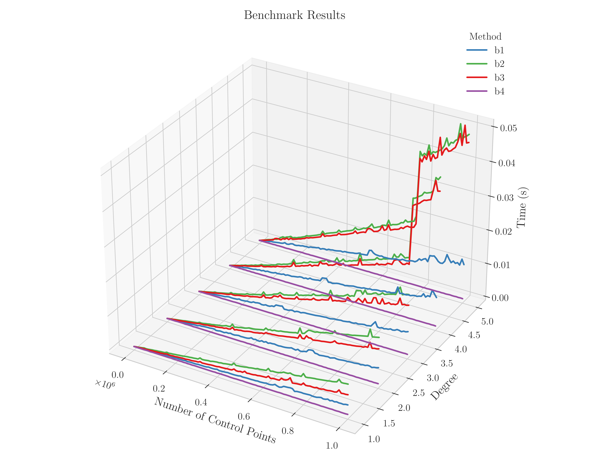
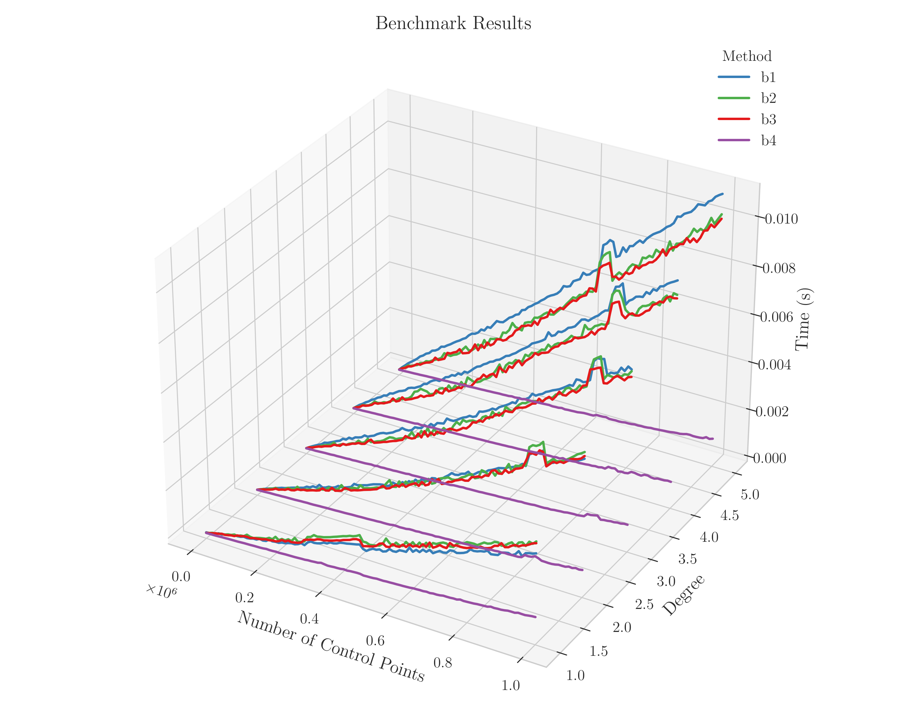
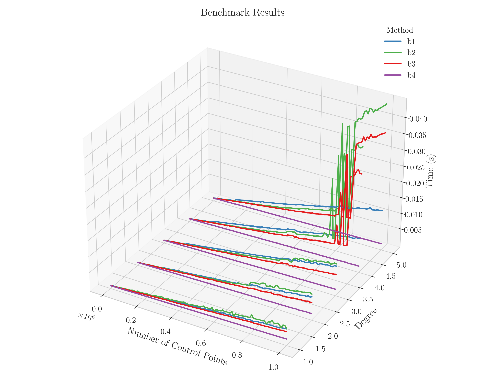
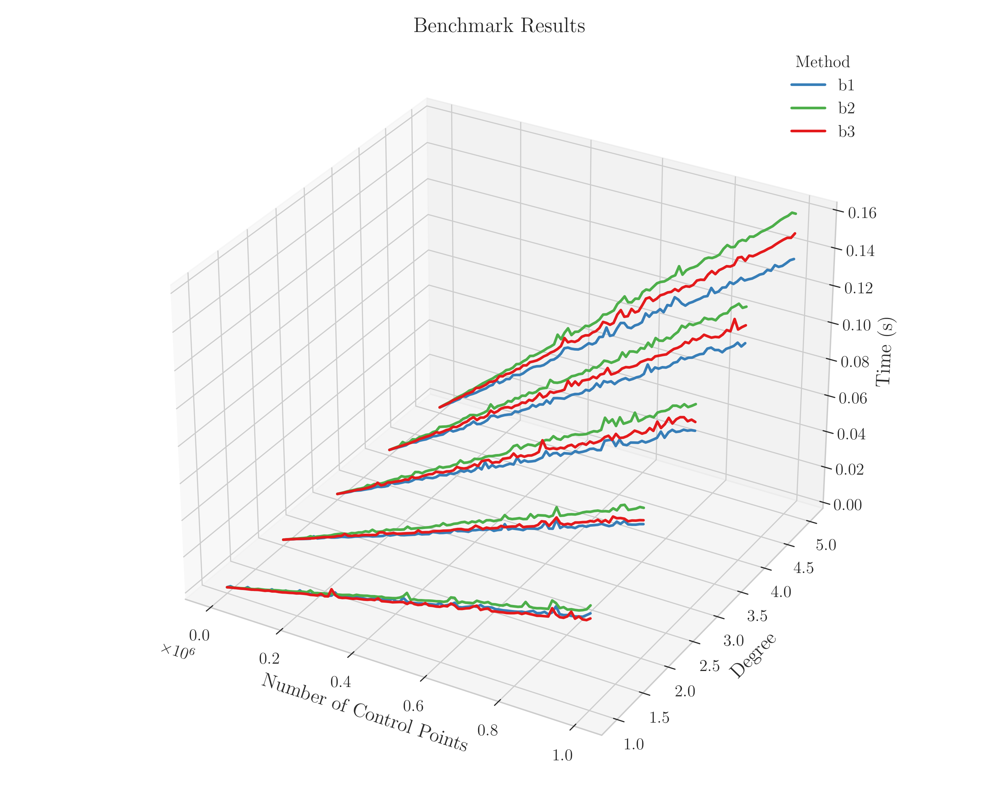

# B-spline Basis Function Benchmark

## Overview

This benchmark evaluates and compares the computational efficiency of multiple implementations of B-spline basis functions. Performance is measured as elapsed computation time across various polynomial degrees and numbers of control points, providing insights into scaling and efficiency.

## Definition of B-spline Basis Functions

B-spline basis functions of degree $d$ are defined using the recursive Cox–de Boor formula. Starting with degree zero $(d = 0)$, the basis functions are piecewise constants:

$$
B_{i,0}(t) = \begin{cases}
1, & k_i \leq t < k_{i+1}, \\
0, & \text{otherwise.}
\end{cases}
$$

For higher degrees $d \geq 1$, the basis functions are defined recursively as:

$$
B_{i,d}(t) = \frac{t - k_i}{k_{i+d} - k_i} B_{i,d-1}(t)
+
\frac{k_{i+d+1} - t}{k_{i+d+1} - k_{i+1}} B_{i+1,d-1}(t)
$$

Here, $t$ is the evaluation parameter, $k$ represents the knot vector and $i$ denotes the control point index.

## Benchmark Parameters

* **Methods Evaluated:** `b1`, `b2`, `b3`
* **Polynomial Degrees:** 1 to 5
* **Number of Control Points:** 0 to 1,000,000 (incremented by 10,000)

Parameters can be adjusted in the file `app/bench.f90`.

## System Specifications

Benchmarks were performed on the following system:

| **Specification**    | **Details**                               |
| -------------------- | ----------------------------------------- |
| **Processor**        | Intel(R) Core(TM) i9-9980HK CPU @ 2.40GHz |
| **Memory**           | 64 GB                                     |
| **Operating System** | Ubuntu 24.04.2 LTS                        |

## Elapsed Time Results

The following plots illustrate elapsed computation times for polynomial degrees 1 through 5:

<div align="center">

<table>
  <tr>
    <th align="center">GNU Fortran<br>(gfortran 15.1.0)</th>
    <th align="center">Intel Fortran<br>(ifx 2025.1.0)</th>
  </tr>
  <tr>
    <td align="center"></td>
    <td align="center"></td>
  </tr>
  <tr>
    <th align="center">NVIDIA Fortran<br>(nvfortran 25.5-0)</th>
    <th align="center">LLVM Flang<br>(flang 20.1.6)</th>
  </tr>
  <tr>
    <td align="center"></td>
    <td align="center"></td>
  </tr>
</table>

</div>

## Compilation and Execution

Compile and run the benchmark using the Fortran Package Manager (`fpm`):

| Compiler           | Command   |
| ------------------ | --------- |
| **GNU Fortran**    | `fpm @gf` |
| **Intel Fortran**  | `fpm @if` |
| **NVIDIA Fortran** | `fpm @nv` |
| **LLVM Flang**     | `fpm @fl` |

### Customizing Compiler Flags

Modify compiler flags by editing `fpm.rsp` located in the project's root directory.

### Setting the Number of Threads

Set the `OMP_NUM_THREADS=n` environment variable for parallel execution. For `nvfortran`, which uses OpenACC, set `ACC_NUM_CORES=n`.

## Adding New Methods

To add a new B-spline basis function implementation:

1. Implement the method in `src/bspline_basis.f90`.
2. Update the method names array in `app/bench.f90`.
3. Extend the `select case` statement in `app/bench.f90` accordingly.

## Plotting Results

Generate the plot using the provided Python script located in scripts/plot.py. From the root directory, execute:

```bash
python scripts/plot.py
```

The generated plot will be saved in the repository's root directory.
